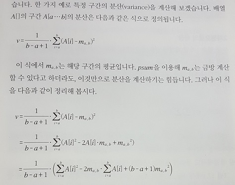

17장. 부분 합

* 부분 합의 이용
	* 구간 합
		* 하나의 배열에 대해 구간 합을 여러번 수행해야 할 경우 O(n)에 부분합을 구해놓으면 그 이후에는 O(1)만에 구간합을 구할 수 있다.
	* 평균
		* 구간합의 결과를 구간의 크기로 나눠주면 O(1)만에 평균을 구할 수 있다.
	* 분산 (variance)
		* 부분합 배열과 각 원소의 제곱의 부분합 배열 2개를 이용하여 O(1)만에 분산을 구할 수 있다.
		* 공식
			*   
	* 2차원 배열의 구간합
		* 2차원의 부분합 배열에 각 index(i,j)가 왼쪽상단을(0,0) 오른쪽하단을(i,j)로 갖는 직사각형 구간의 부분합을 저장해두면 (x1,y1) ~ (x2,y2) 구간합을 O(1)만에 구할 수 있다.
		* rangeSum(x1,y1,x2,y2) = partitionSum(x2,y2) - partitionSum(x2,y1-1) - partitionSum(x1-1,y2) + partitionSum(x1-1,y1-1)

* 예제
	1. 구간 합 계산(cal\_range\_sum) : solve(2017-11-06)
	2. 분산의 계산(cal\_variance) : solve(2017-11-06)
	3. 2차원 배열의 구간합 계산(cal\_matrix) : solve(2017-11-06)
	4. 합이 0에 가장 가까운 구간(get\_zero\_approximate\_range) : solve(2017-11-06)
	5. 크리스마스 인형(christmas) : solve(2017-11-07)